# Green Park Activity Webpage

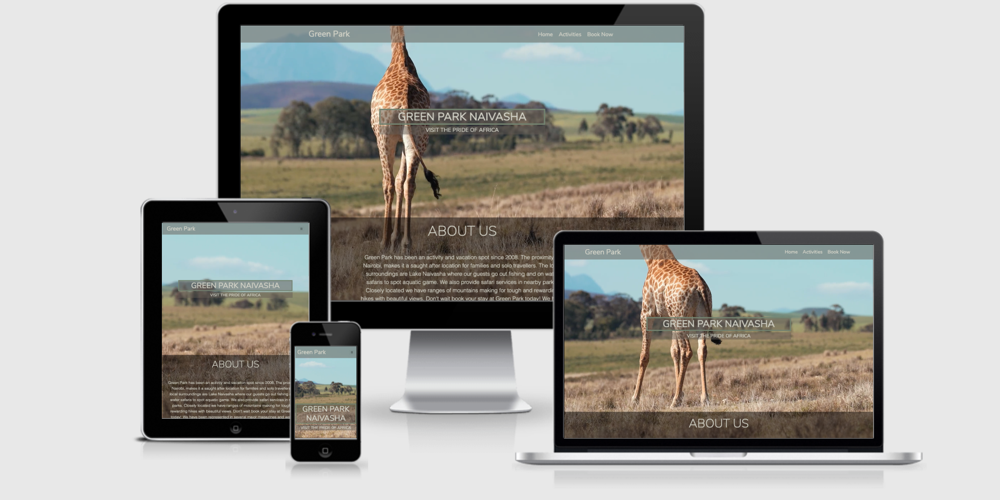

The live website can be found [Green Park](https://dkidanu1.github.io/Milestone2/).

___
## Index

1. About the website
2. User Experience Design
3. Design
4. Technology Used
5. Testing
6. Deployment
7. Acknowledgements
___

## About the website 

This Green Park Website was created for the purpose of completing the second Milestone Project for the Code Institute's Full Stack Developer course. It was built using the knowledge gained from the HTML, CSS, User Centric Design, JavaScript Fundamentals and Interactive Frontend Development modules. The document below outlines the build and various technologies used. 

___

## User Experience Design

### The Strategy Plane

The Green Park website was created to showcase knowledge gained in HTML, CSS & JavaScript and to provide users with insights into the wide variety of offerings available to them in Naivasha, Kenya. The website should be easy to understand, simple to interact with and give the user feelings of excitement and curiosity.

__Site Goals__:

- Aim of the website is to showcase the learnings I have gained through the milestone 1 and milestone 2 courses in HTML, CSS, JavaScript.
- To provide users with a simple and aesthetic interactive website to view, book a stay and book activities at Green Park Naivasha.
- To create a user experience that makes the user want to return to the website and book again. 

__User Stories__: 
1. As a user, I want to easily understand the main purpose of the site.
2. As a user, I want to see what I can expect from Green Park Naivasha, so that I can make a decision on whether to visit.
3. As a user, I want to view the website and content clearly on any device.
4. As a user, I want to find out the activities I can do in Green park and at what. 
5. As a user, I want to be able to book a stay at Green park.
5. As a user, I want to see contact information for the site owner in case I want to reach out with any queries I have about the site.

### The Scope Plane

The website will include scenic imagery of Green Park and the close surrounding area. Information about the activities and the area will be provided, highlighting all the services available. 
A highlight of the best locations for food and activities will be made available through information markers on the map. To book through the site, users will send a message with their desired excursions and dates. 
With the website we want to showcase transparency, reliability and trust. To be able to convert users into customers the site must speak to them directly and prompt them to want to join us for experiences. 
The website will showcase the brand, and take a more aspirational approach to travel and experiences. With a simple design the website will be clear and easy to navigate.

__Features planned__: 
- Page Heading – Clearly indicating what the website is about.
- About us – Explanation of the activities and offerings.
- Background Video – To give that aspirational feeling and curiosity of the experiences.
- Navigation arrows – To prompt the user to move to the next section .
- Google Map API – To provide the user with clear indication of where the place is located .
- Footer Items - Contact Information and link to Social pages.
- Carousel – To Showcase various experiences in a visual way.
- Text Slide Show - To showcase JS learning and testimonials for Green Park.
- Navigation – Javascript to support with the extra touch of smoothness on the scroll.
- Contact us – Email JS to support and facilitate and questions and enquires users have. Including Validation to ensure the right information is presented in the form.

### The Structure Plane
The website is going to have 3 pages each with a distinctive aim and purpose:

-   __Home__: Provide aspirational feel and introduction to Green Park and the Location.
- __Activities__: Provides information on which activities are provided and how to access them.
- __Book Now__: Allows the user to gain insights into costing and book a stay or activities. 

The 3 pages consist of different sections: About us, locate us, Activities, Image Carousel and contact us.
A navigation bar which will be adapted accordingly for the mobile version, will be static on the top of the website. This will allow the user to move to any other section easily without scrolling or searching for the navigation. 
Links throughout the website will be responsive to the hover, on the navigation bar it will be underlined and socials will change colour, this will indicate to the user that upon click there is further information or content. All links that will open an external page will do so on another tab.

### Skeleton Plane

__Wireframes__
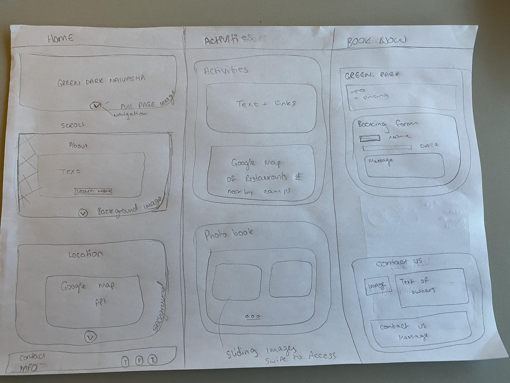
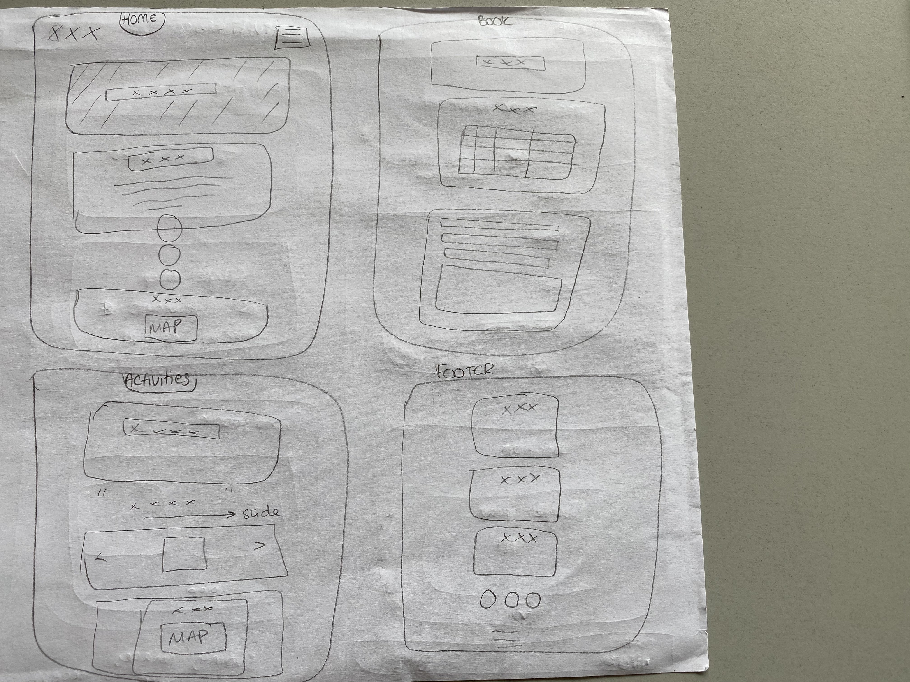
The Website will have a consistent theme in terms of typography, sizing, colour and feel. Each page will have a unique background giving it a unique identifier. The design will be consistent and should leave a sense of aspiration and excitement. Simplicity was really the key for the design, I did not want to over crowd or leave the user confused.

Initially I wanted to create a website that had a single page, but after designing and thinking through the user flows I decided multiple pages would work best for the needs of the website. 

### Surface Plane
__User Stories__

1.	As a user, I want to easily understand the main purpose of the site.

Acceptance Criteria: 
-	Heading provides indication on the location “Naivasha”
-	Sub heading provides indication of purpose of site 
-	About us section provides the user clarity in simple and easy to understand language

__Description__:
There will be a heading which will give away the location information and the about section will delve in deeper to the use of the website and what value add it will provide to the user. 

2.	As a user, I want to see what I can expect from Green Park Naivasha, so that I can make a decision on whether to visit.

Acceptance Criteria:

-	Clear indication of what users can do at Green Park *Visual & Written”

__Description__:
The activities and book now page provides clear and simple information on the activities that can be undertaken and the costing of each.

3.	As a user, I want to view the website and content clearly on any device.

Acceptance Criteria:
-	Website layout is well displayed and readable across all sized devices

__Description__:
Bootstrap will be used to lay the content of the Website out in containers, rows and columns. Using this framework means we are using mobile first design. Elements will not overlap containers and items should be responsive.

4.	As a user, I want to find out the activities I can do in Green park and at what. 

Acceptance Criteria:
-	Clear outline of activities providing information on how to access the experience
-	Clear indication of costing and what it takes to carry out the experience

__Description__:
Information to be included: List of activities that are provided, the cost of each activity. The duration of each activity will also be provided to allow user to prepare for their trip effectively. 

5.	As a user, I want to be able to book a stay at Green park.

Acceptance Criteria:
-	Email section is easy to find
-	Email sending “submit” function is working properly 

__Description__:
User should easily locate the contact us section to allow them to book, they will in this section be able to submit a form, upon which they should return a “Successful” message. 

6.	As a user, I want to see contact information for the site owner in case I want to reach out with any queries I have about the site.

Acceptance Criteria: 
-	Contact information displayed in footer 

__Description__:
Contact information will be added into the footer section and will remain consistent across each page. 
___

### DESIGN

For this project I decided on a 3 page layout, to create separation and allow me to show 3 distinct elements of the Green Park Experience. I wanted the user to experience nature like they have never before, to achieve this on the landing page there is a full screen video with a Giraffe in its natural habitat, showcasing the wilderness and the beauty of the African Savannah. 
With the design I wanted the user to feel a sense of excitement and curiosity in the adventure that lay ahead. To achieve this, I used a minimal layout, but well planned in its details. Utilized small bursts of black opaque overlay to still give the nature the chance to shine through. 

##### Colour Scheme

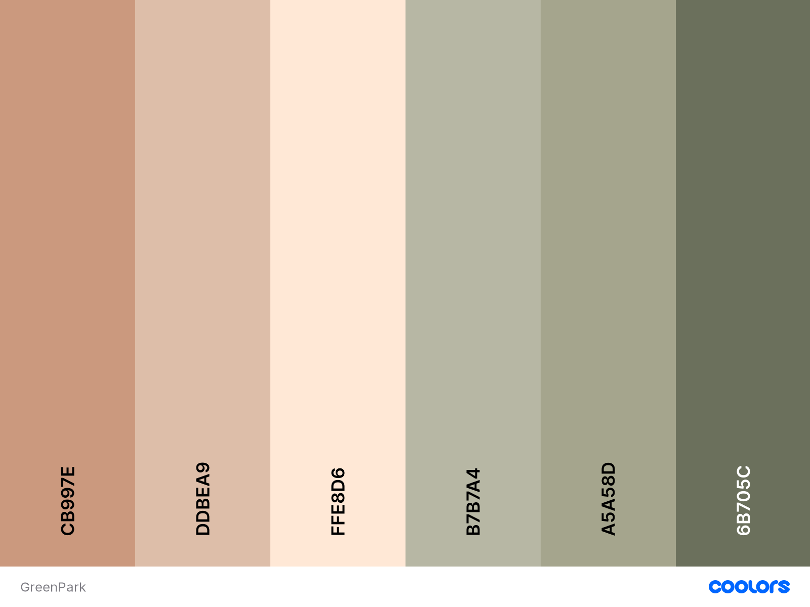

The colour palette that I choose reminds me of nature and calm. Throughout the website the colours are repeated, so that the user feels comfortable. Hovering over links or on the contact form, repeats as well the same colour palette. 
As I was developing I realized the light share of pink/grey didn’t work for the backgrounds I had chosen as it was too light.  At this point I decided to experiment with an additional shade that could work. I kept the colors chosen as simple and calming to continue with the overall theme of the website, really conveying nature and the softness of it. 
To help me with the choice of colours I used the Coolors.com

##### Typography
The font that I used are "Montserrat" and "Nunito Sans". They are very modern and minimal and I think they work well with the design. I played around with the sizing and font-weight to come to the best for the given spaces. 

##### Imagery
The imagery chosen for this project came from a trip I made to Green Park myself, this gave me the idea for the website, to supplement the photos I took myself I selected the full screen video and a few images from Pexels.
Additionally, to keep a consistent feel to the website I decided to design the logos for the news outlets mentioned on the Home page. To do this I used Canva and exported each logo individually.
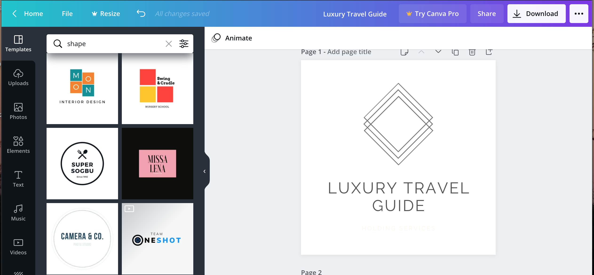
___

### Technologies Used: 

##### Languages Used
•	HTML5

•	CSS3

•	Javascript
##### Frameworks, Libraries & Programs Used
•	Bootstrap 4.5.0.

•	Google Fonts

•	Font Awesome 4.7.0.

•	jQuery

•	Git

•	GitHub

•	GitPod

•	Chrome DevTools

•	Autoprefixer CSS

•	Google Maps API

•	EmailJS API

•	Favicon.ico
___

### TESTING

#### Functionality Testing

#### Interaction 

The website was tested and reviewed using the following steps: 

Home Page:
1. Check that background video loads and plays (Verified)
2. Cheack screen size rendering for all sections of the page (Verified)
> The footer section had a positioning issue on mobile and tablet views. This was fixed utilizing columns in bootstrap. 
3. Check the map renders and provides the right location? (Verified)
4. Check Social Media links work and open on a new tab(Verified)
5. Check Navigation links work (Verified)

Activities:
1. Check background Image loads and displays (Verified)
2. Cheack screen size rendering for all sections of the page (Verified)
>The footer section had a positioning issue on mobile and tablet views. This was fixed utilizing columns in bootstrap.
3. Check article links are working and open on a seperate tab (Verified)
4. Check testimonial carousel moves and scrolls to different quotes (Verified)
5. Check if image carousel functional (Verified)
6. Check if map renders pins and zooms to reveal locations (Verified)
7. Check Social Media links work and open on a new tab(Verified)
8. Check Navigation links work (Verified)

Book now:
1. Check background Image loads and displays (Verified)
2. Cheack screen size rendering for all sections of the page (Verified)
>The footer section had a positioning issue on mobile and tablet views. This was fixed utilizing columns in bootstrap.
3. Check if table of pricing renders (Verified)
4. Check Social Media links work and open on a new tab(Verified)
5. Check Navigation links work (Verified)

Contact form:
1. Check if the form submits with numbers in name and surname section
> Form does not submit and renders an alert message 
2. Check if form submits with numbers in surname section
> Form does not submit and renders an alert message 
3. Check if form submits with no email but all other fields correct
> Form does not submit and message pops up within the form to indicate email structure needed
4. Check if form submits name, surname and email correct but no message
> Form does not submit and renders an alert message 
5. Submit form with all information in fields correct but not checking the check box
>Form does not submit and renders an alert message to verify humanity

The form fields have been checked and fields are correctly validated and a message is sent and received accordingly.

#### Issues Found
A problem was found in the successfully submitted function, the bootstrap alert was not being activated appropriately, thus for this fix I opted to use JS function. Initially I had put the Script to call the successful message in the HMTL File, I found that it wasnt working for the purpose of what I was trying to achieve. By moving the code into the email.js file and adjusting the syntax with multiple tests using the console and clearing the cache several times I got the desired outcome.

Which was a Fixed submitted message, and the form returning a message on the website, so the user knows that everything went well. Another important element that needed alot of testing was the clearing of the form elements. 
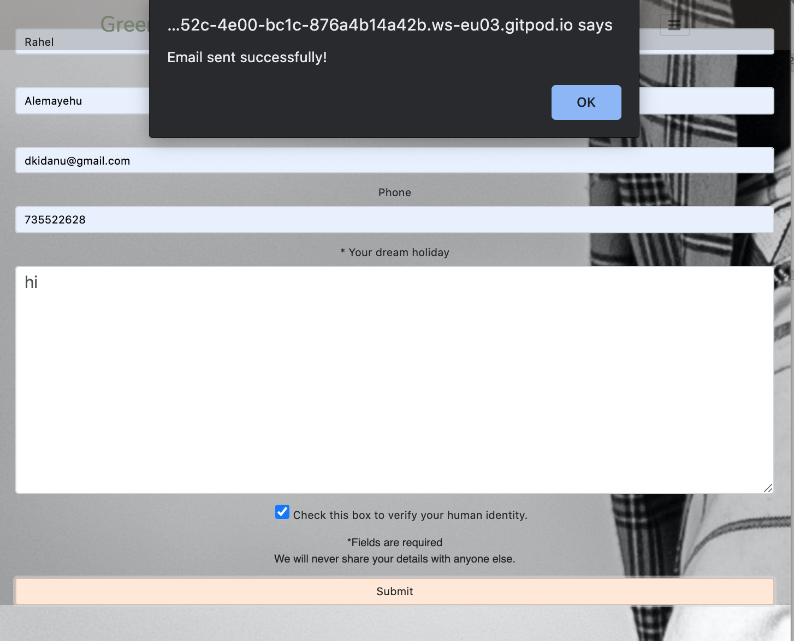

When inititally testing the functionality of the contact us form, I encountered a number of issues with the functions. After utilizing the console to identify where the issue was I had to get creative in my problem solving. I utilized a debugger to see if I could find out where exactly the issue was occurring. 
I did not have much luck with that so later opted to use the ESC option to pause the process and see what was being logged, this is a hack I found on stack overflow. The idea was to prevent the event from reloading so we could see the error message. 
After identifying the issue, I was able to get the functionality working for the contact us form. 

When developing the validation section a number of issues arose in development. The aim of this section was to ensure the form validated each field before submitting the form. The first issue that arose was a referencing issue in the form. To fix this a definition was added for the specific element 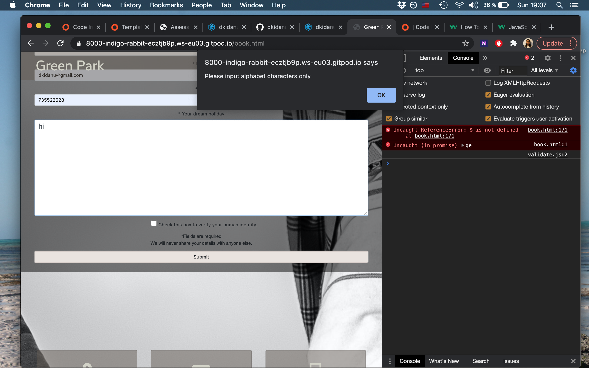

Furthermore there was an issue with elements that were not defined. This was for the text element that I had initially included in the validation function, I later removed this function in place for styling 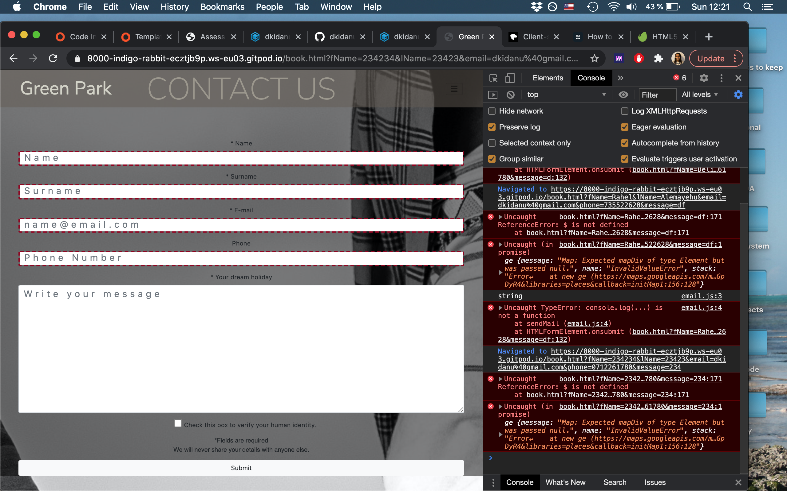

Moreover, there were issues with spacing and mobile first design. This was particularly for the footer sections and the Google Maps. To solve this issue, I utilized bootstrap and Google maps documentation as well as the “Inspect” tool. It was a process with small iterations over time.  I utilized the fiddle tool to see how various code changes would react: 
[JS Fiddle](https://jsfiddle.net/api/post/library/pure/) and [Google Documentation](https://developers.google.com/maps/documentation/javascript/marker-clustering?hl=en#maps_marker_clustering-typescript)
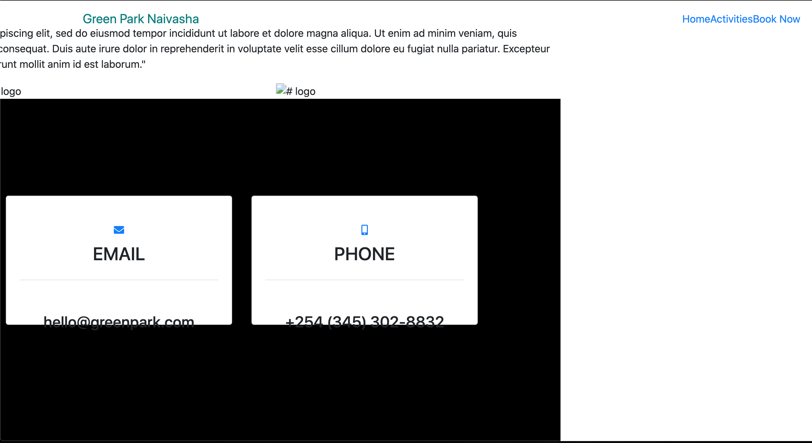

#### Responsiveness
To test the responsiveness of the site I managed to get the sizing and spacing the way I wanted it to be, but going forward this is something I will be more contagious of from the beginning of the build to prevent and such issues from arising. 

In this test the website was tested to all default device sizes provided by chrome dev tools.

360 x 640 Galaxy S5
375 x 667 iPhone 6/7/8
375 x 812 iPhone X
411 x 731 Pixel 2
411 x 823 Pixel 2 XL
414 x 736 iPhone 6/7/8 Plus
768 x 1024 iPad
1024 x 1366 iPad Pro
> Issues were found in positioning for the footer in Ipad sizing. This was rectified with bootstrap colums.

#### Code Validation

To validate the code validation software was utilized:

HTML was validated using the [HTML Validator](https://validator.w3.org/nu/#textarea) 

- index.html
> - The type attribute for the style element is not needed and should be omitted.(Fixed)
> - Violations identified scroll-blocking, touchmove, and touchstart event. These are being monitored during site performance. 
- book.html
> - The type attribute for the style element is not needed and should be omitted. (Fixed)
> - The type attribute is unnecessary for JavaScript resources. (Remains as a warning )
> - Attribute pattern is only allowed when the input type is email, password, search, tel, text, or url. At this point a decision was made to keep the type as number, this provides the best functionality for the form and opposed to type tel which does not complete the validation as needed. (Remained as is)
> - Error on Map Found (Fixed) 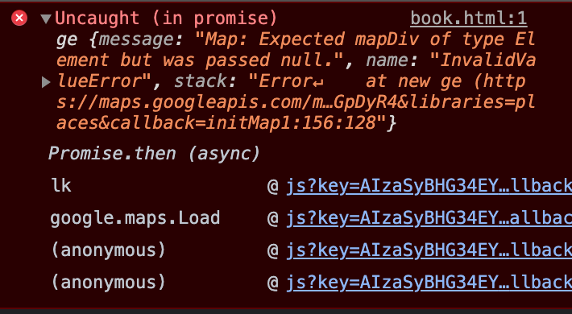
- activities.html
> - The type attribute for the style element is not needed and should be omitted. (Fixed)

CSS was validated using the [CSS Validator](https://jigsaw.w3.org/css-validator/). 

- style.css
> The below errors were identified and fixed during testing. 
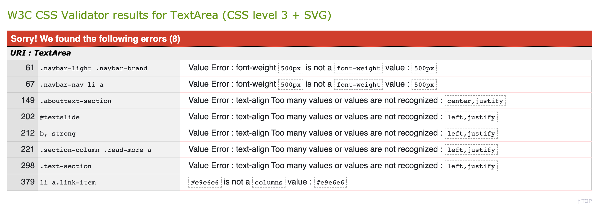

JS was validated using the console.log as I was coding elements, additionally validated using [JS Hint](https://jshint.com/)

- email.js
> Warninigs were identified and will continue to be monitored:
> - Assignment or function call and instead saw an expression.
- map.js
> Warninigs were identified and will continue to be monitored:
> - const' is available in ES6 (use 'esversion: 6') or Mozilla JS extensions.
- slideshow.js
> Warninigs were identified and will continue to be monitored:
> - const' is available in ES6 (use 'esversion: 6') or Mozilla JS extensions.
- validate.js
> - Missing Semi colons identified
> - Problem/ TypeError: Cannot read property 'requestContent' of undefined

##### Usability Testing 

To test the usability, I utilized the website myself on various devices and using Chrome DevTools. I also sent the link to friends and my mentor to gather usability information. 
According to the testers the contract between background image and text colour didn’t make it easy for the user to read the text, I made changes following this. 
All the images have the "alt" text.
I tested the website with Wave to check if something can be improved in terms of accessibility. 

I then tested the responsiveness of the site on: [Ami responsive design](http://ami.responsivedesign.is/). I tested on iPhone 11 and extra-large desktop using this tool. This process helped me identify that the maps used were not responding to the screen size change, once I made that fix I was successful in making the full website responsive with a mobile first design.

##### User Stories Tests

1. As a user, I want to easily understand the main purpose of the site. | Usability Test
------------ | -------------
Heading provides indication on the location “Naivasha”| User was able to easily identify the location of Green Park. 
Sub heading provides indication of purpose of site| Wording was unclear and tweaked based on feedback.
About us section provides the user clarity in simple and easy to understand language | User was unclear on what the offering is, copy was updated to reflect the offering from Green Park.

2.	As a user, I want to see what I can expect from Green Park Naivasha, so that I can make a decision on whether to visit.| Usability Test
------------ | -------------
Clear indication of what users can do at Green Park *Visual & Written” | User was able to visualize the activities and have clarity of how to access the experiences

3.	As a user, I want to view the website and content clearly on any device.| Usability Test
------------ | -------------
Website layout is well displayed and readable across all sized devices | User was able to see full website on all devices and the usability checks conducted validated this. 

4.	As a user, I want to find out the activities I can do in Green park and at what. | Usability Test
------------ | -------------
Clear outline of activities providing information on how to access the experience | User understood activities would be accessed from the Book page and headed there after reading content on site
Clear indication of costing and what it takes to carry out the experience | Cost was clearly displayed and table helped user understand how long each experience is and how the cost implicates that. 

5.	As a user, I want to be able to book a stay at Green park.| Usability Test
------------ | -------------
Email section is easy to find | Book page on the Nav bar was easy to understand and indicated to user that once they are ready to make a booking that is where they need to go
Email sending “submit” function is working properly | Submit function works and returns a success message to the user. 

6.	As a user, I want to see contact information for the site owner in case I want to reach out with any queries I have about the site.| Usability Test
------------ | -------------
Contact information displayed in footer | Email, Address and personal information can be found on the footer, easily accessible to the user


##### Compatibility Testing
I tested the website on multiple browsers:

•	Chrome

•	Firefox

•	Internet Explorer

•	Safari
___

## Deployment
#### GitHub Pages
The website was deployed using the following steps:

•	Log in into GitHub;

•	Click on repository;

•	Select project to be deployed;

•	Click on "Settings";

•	Scroll down to "GitHub Pages" section;

•	On "source" select "master branch" from the dropdown menu;

•	Full page will be re-loaded automatically;

•	Scroll down to "GitHub Pages" again;

•	It will read "Your site is published at https://github.com/dkidanu1/Milestone2"

Replicate the code: If you are looking to adapt of utilise this code on your own, follow the below instructions:

•	Log in to GitHub;

•	Identify the repository you are looking for, in this case it can be found here https://github.com/dkidanu1/Milestone2

•	Top-right of the page, click on a button called "Fork";

•	This will will fork the code to your GitHub.

#### Local Clone
To make a local clone of the site, just follow these steps:

- Log in to your GitHub;
- Under your repository section, select the repo that you need;
- You will find a green button with the name "Code". Click on it;
- On the dropdown selection, you will find a link to clone the code with HHTPS;
- Now open Git pod;
- Open the directory where you want to work on the cloned code;
- Type git clone followed by the link you have previously copied.

#### Gitpod Reminders
For this project the Code Institute student template for Gitpod was utilized. It has preinstalled all of the tools needed to get started.

To run a frontend (HTML, CSS, Javascript only) application in Gitpod, in the terminal, type:

python3 -m http.server

- A blue button should appear to click: Make Public,

- Another blue button should appear to click: Open Browser.

To run a backend Python file, type "python3 app.py", if your Python file is named app.py of course.
A blue button should appear to click: Make Public,
Another blue button should appear to click: Open Browser.

### Acknowledgements
I received inspiration for this project from a mixture of webistes but most notably The Luxury Safari Company and Go to Africa.
•	Got inspiration for text slide show feature from - https://www.w3schools.com/howto/howto_js_quotes_slideshow.asp
•	Read me inspiration -https://github.com/Daisy-McG/milestone-project-two
